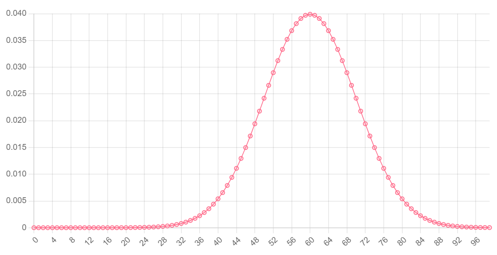

# Fundamental statistics
This package contains functions for **calculating and plotting** probability denisities, cumulative densities, expected values and variances of a few fundamental distribution functions.

- [Installation](#installation)
- [Binomial distribution](#binomial-distribution)
  * [Probability mass function](#probability-mass-function)
  * [Cumulative probability function](#cumulative-probability-function)
  * [Expected value and variance](#expected-value-and-variance)
- [Negative binomial distributions](#negative-binomial-distributions)
  * [Probability mass function](#probability-mass-function-1)
  * [Cumulative probability function](#cumulative-probability-function-1)
  * [Expected value and variance](#expected-value-and-variance-1)
- [Geometric distributions](#geometric-distributions)
  * [Probability mass function](#probability-mass-function-2)
  * [Cumulative probability function](#cumulative-probability-function-2)
  * [Expected value and variance](#expected-value-and-variance-2)
- [Normal distributions](#normal-distributions)
  * [Probabilty mass function](#probabilty-mass-function)
  * [Cumulative probabilty function](#cumulative-probabilty-function)
  * [Expected value and variance](#expected-value-and-variance-3)
- [Poisson distributions](#poisson-distributions)
  * [Probability mass function](#probability-mass-function-3)
  * [Cumulative probabitly function](#cumulative-probabitly-function)
  * [Expected value and variance](#expected-value-and-variance-4)

<small><i><a href='http://ecotrust-canada.github.io/markdown-toc/'>Table of contents generated with markdown-toc</a></i></small>


## Installation
To use this package, you can use this script tag in an HTML page:

```
<script src="https://unpkg.com/fun-stats@latest/dist/fun-stats.min.js"></script>
```

Or you can use npm.

```
npm i fun-stats
```

Note that if you use npm, the function calls in the examples below might need to be implemented differently. For example:

```
// using script tag
binomial(3, 10, 0.5)

// using npm/cjs
const fnst = require("fun-stats")
fnst.binomial(3, 10, 0.5)
```

## Binomial distribution
Functions `binomial`, `biCD`, `biE`, `biVar` all relate to the binomial distribution. 
This distribution describes a situation with a binary outcome. Conventionally, one of the two outcomes is labelled as a "success". However, there doesn't have to be anything especially successful about that particular outcome.

A good example of when you would want to use a binomial distribution is modelling a series of coin flips.

### Probability mass function
`binomial(x, n, p)` calculates the probability of observing `x` successes in `n` trials, given the probablity of a single success (`p`)

Example: calculate the probability of observing 3 heads in a series of 10 flips
```
// you observe three heads
const x = 3

// you flipped the coin 10 times
const n = 10

// there is a 50% chance of observing heads on each flip
const p = 0.5

const probability = binomial(x, n, p)
// 0.1171875, or ~12% probability of seeing exacty 
// 3 heads in 10 coin flips
```

Here is a chart showing the probabiltiy (y-axis) of observing a certain number of successes (x-axis) out of 50 trials, when the probability of one success is 0.5:


You can see that the most probable outcome is observing 25/50 successes. This makes sense given that each trial has a 50% chance of succeeding, and 25/50 is equal to 50%.

### Cumulative probability function
`biCD(x, n, p)` calculates the probability of observing **less than or equal to `x` successes** in `n` trials, given the probablity of a single success (`p`).

Example: calculate the probability of observing 5 or fewer heads in a series of 10 coin flips
```
// five or fewer heads
const x = 5

// the coin was flipped 10 times
const n = 10

// there is a 50% chance of observing a heads on each flip
const p = 0.5

const answer = biCD(x, n, p)
// 0.623046875, or ~62% probability of seeing 5 or 
// fewer heads in 10 coin flips
```

Here is a chart showing the probabiltiy (y-axis) of observing a certain number of successes **or fewer** (x-axis) out of 50 trials, when the probability of one success is 0.5:


We can be pretty much certain that we will observe 35 or fewer successes out of 50 trials. In other words, it would be extremely unlikely to have not obeserved *any* successes after 35 trials (imagine getting the same result on a coin flip 35 times in a row!). This can also be said for any value of `x` (x-axis) that has a probability (y-axis) of 1, or very close to 1. 

### Expected value and variance
The expected value of a binomial distribution refers to the number of successes you would expect to observe in a given number of trials.
The variance of a binomial distribution tells us how far the outcomes are expected to deviate from the expected value.

```
// n = 10, number of coin flips
// p = 0.5, probability of heads each flip

const expected = biE(10, 0.5)
const variance = biVar(10, 0.5)
```

## Negative binomial distributions
Negative binomial distributions can be used to find the number of trials needed to get a fixed number of successes, given a consistent probability of success on each trial and a binary outcome. I explain those terms a bit more in the binomial distribution section above.

### Probability mass function
`negBinomial(n, r, p)` finds the probability that you would see exactly `r` successes after `n` trials, given `p`, the probability of a single success. 

Example: calculate the probability that after exactly 20 rolls of a dice you will have observed exactly 5 sixes
```
// n = 20, 20 dice rolls
// r = 5, 5 sixes
// p = 1/6, chance of getting a 6 on any roll

const probability = negBinomial(20, 5, 1/6)
// 0.032, or 3.2% 
```

Here is a chart showing the probability (y-axis) of observing exactly 5 successes after a certain number of trials (x-axis), with a probability of success of 1/6:


### Cumulative probability function
`negBiCD(n, r, p)` finds the probability that you would see exactly `r` successes after `n` trials **or on any previous trial**, given `p`, the probability of a single success. 

Example: calculate the probability that after 10 rolls or fewer of a dice that you will have observed exactly 2 sixes
```
// n = 10, 10 dice rolls
// r = 2, 2 sixes
// p = 1/6, chance of getting a 6 on any roll

const probability = negBiCD(10, 2, 1/6)
// 0.515, or ~52% chance of seeing exactly 2 sixes on any roll up to 10 rolls
```

Here is a chart showing the probability (y-axis) of observing exactly 5 successes after a certain number of trials **or fewer** (x-axis), with a probability of success of 1/6:


### Expected value and variance
`negBiE(r, p)` finds the expected value of a negative binomial distribution. In other words, it finds the number of trials it will most likely take to observe `r` successes.

`negBiVar(r, p)` calculates a metric for the extent to which the actual number of trials deviates from the expected number of trials.

```
const r = 5
const p = 1/6

const expected = negBiE(r, p) 
// 30 trials most likely to get 5 sixes

const variance = negBiVar(r, p)
// 150, so you may rarely actually observe exactly
// 5 sixes after exactly 30 trials.
```

## Geometric distributions
For a series of independant trials with a binary outcome, the number of trials needed to get **one success** has a geometric distribution. If those terms are not clear, I expand on them a bit in the section on binomial distributions. You can think of it like a negative binomial distribution (described in the section above) but the number of successes is fixed at 1.

### Probability mass function
`geo(x, p)` finds the probability of a single success after **exactly `x` trials**., given the probability of a success `p` in any given trial. 

Example: calculate the probability of being dealt 21 in a game of blackjack on your 5th hand
```
// x = 5, 5th hand
// p = 0.048, 4.8% chance of being dealt 21 in a single hand

const probability = geo(5, 0.048)
// 0.039, 3.9%
```

Here is a plot of the probability (y-axis) of observing a single success after a certain number of trials (y-axis), given a 10% probability of observing a success on a single trial:


You can see that the probabiltiy of observing a single success starts at 0.1 and decreases as the number of trials increases. This is because it becomes more and more likely that you will observe *more than* a single success as the number of trials increases.

### Cumulative probability function
`geoCD(x, p)` finds the probability of observing a single success after **`x` or fewer trials**.

Example: calculate the probability of being dealt a single hand of 21 in a game of blackjack in 5 or fewer hands.
```
// x = 5, 5th hand
// p = 0.048, chance of being dealt 21

const probability = geoCD(5, 0.048)
// 0.22, or 22%
```

Here is a chart showing the probability of observing exactly one success (y-axis) in a given number of trials **or fewer** (x-axis). There is a 0.1 probability of success on any given trial.


### Expected value and variance
`geoE(p)` finds the expected value of a negative binomial distribution. In other words, it finds the number of trials it will most likely take to observe a single success.

`geoVar(p)` calculates a metric for the extent to which the actual number of trials deviates from the expected number of trials.

These functions are equivalent to `negBiE(r, p)` and `negBiVar(r, p)` when the number of trials, `r`, is 1.

```
const p = 0.048

const expected = geoE(p)
// 20, most likely to be dealt your first 21 on 
// the 20th trial

const variance = geoVar(p)
// 413, huge variance so the expected value may only
// be useful on a large scale
```

## Normal distributions
This distribution is often used in statistics to model random continuous variables. Essentially, values of the variable become less and less likely the further they are from the centre of the distribution (i.e., the mean or expected value).

### Probabilty mass function
`norm(x, mu, sd)` finds the probabilty of observing the value `x` on a normal distribution defined by `mu` and `sd`, the centre of the distribution and the extent of the spread around the centre (specifically, the standard deviation ).

Example: find the probability of your full-term baby being born with a weight of 4kg
```
// x = 4, the baby is born at 4kg
// mu = 3.5, the mean weight of a full-term baby
// sd = 0.385, the standard deviation of weights

const probability = norm(4, 3.5, 0.385)
// 0.450, or 45% chance of observing a 4kg newborn
```

Here is a chart showing the probability (y-axis) of a value (x-axis) being drawn from a normal distribution with a mean of 25 and a standard deviation of 8.


### Cumulative probabilty function
`normCD(x, mu, sd)` finds the probabilty of observing any value between `mu` (the centre) and `x`. 

Example: calculate the probabilty of a full-term baby being born with a weight between the average weight and 4kg
```
// x = 4, the baby is born at 4kg
// mu = 3.5, the mean weight of a full-term baby
// sd = 0.385, the standard deviation of weights

const probability = normCD(4, 3.5, 0.385)
// 0.90, or 90% chance of observing a 3.5-4kg newborn
```

Here is a chart showing the probability (y-axis) of a value with an absolute difference from the mean (x-axis) on a normal distribution with a mean of 25 and standard deviation of 8.


### Expected value and variance
There are no functions in this package for calculating these values. The expected value is equivalent to `mu` in the functions above, and the variance of a normal distribution is equal to `sd` to the power of 2.

## Poisson distributions
Poisson distributions are similar to normal distributions, but they are asymmetrical. The probabilty of a value is more heavily penalised for being greater than the mean (expected value) of the distribution than they are for being less than the mean. This assymmetry is defined by a value λ (`L` in the functions below).

They are good models for variables associated with events that occur independantly after a certain amount of time, or a certain distance travelled. For example, you can model reaction times with a Poisson distribution.

### Probability mass function
`poisson(x, L)` finds the probability of observing `x` instances of an event in a certain amount of time (or space), given the average rate of that event, `L` (or λ).

Example: Calculate the probabilty that a museum will get 2 visitor in the next 5 minutes, given that it gets 1 visitor every 5 minutes on average.
```
// L = 1, avg visitors per 5 mins
// x = 2, 2 visitors per 5 mins

const probability = poisson(2, 1)
// 0.18, or 18% chance of seeing 2 visitors in the next 5 minutes
```

Here is a chart of the probabilty (y-axis) of observing a certain number of instances of an event (x-axis), given a poisson distribution with a λ of 5.


### Cumulative probabitly function
`poCD(x, L)` finds the probability of observing `x` **or fewer** instances of an event in a certain amount of time (or space), given the average rate of that event, `L` (or λ).

Example: Calculate the probabilty that a museum will get 5 or fewer visitors in the next 5 minutes, given that it gets 3 visitor every 5 minutes on average.
```
// L = 3, avg visitors per 5 mins
// x = 5, 2 visitors per 5 mins

const probability = poCD(3, 5)
// 0.265, or ~27% chance of seeing 5 or fewer visitors 
// in the next 5 minutes
```

Here is a chart of the probabilty (y-axis) of observing a certain number of instances of an event **or fewer** (x-axis), given a poisson distribution with a λ of 5.


### Expected value and variance
`poE(L)` and `poVar(L)` return the expected value (mean) and variance of a Poisson distribution. The secret is, they both just return `L`. If you know that λ is equal to the mean and variance of a Poisson distribution, then you should never need to use these functions. Check out the source code:

```
function poE(L) {
    return L
}

function poVar(L) {
    return L
}
```

## Plotting
The function `plot(f, data, domId)` is currently quite limited, but here is how it works:

- `f` is the function you want to plot (any of the distribution functions). It's output will be mapped to the y-axis of the chart.
- `data` is an object defining the arguments to pass to function `f`. It's first property will be mapped to the x-axis of the chart.
- `domId` is the id of the HTML element to which the plot should be appended.

Details about `data`:
The first property of the object can (and probably should) be an array (and will be mapped to the x-axis of the chart). The other properties of the object must be single values. **Importantly**, properties of `data` need to be in the order of the arguments of the function. For example, if you are plotting the function `binomial(x, n, p)` the object for data would need to look like this: 

```
{ 
    x: [...], 
    n: ..., 
    p: ... 
}
```

It's property names (keys) follow the order of the argument names in the function: `x`, `n`, then `p`.

Example: plot a normal distribution with a mean of 60 and standard deviation of 10.
```
<div id="plot"></div>
<script>    
    // norm has arguments x, then mu, then sd
    // so object keys should reflect this order
    const data = {
        x: [ ...Array(100).keys() ], // array of 0 to 99
        mu: 60, // mean of 60
        sd: 10
    }

    // create the plot
    plot(norm, data, "plot")
</script>
```


`plot` uses [Chart.js](https://www.chartjs.org/) and it does not (currently) include options for customising plots. If you want more control over your plots, I would recommend using Chart.js directly, or another plotting library.

Here is how to reproduce the example above using Chart.js instead of the `plot` function.

`HTML`:
```
<head>
    <!-- Chart.js CDN -->
    <script src="https://cdn.jsdelivr.net/npm/chart.js@3.9.1/dist/chart.min.js"></script>
</head>
<body>
    <div id="chartjs"></div>
    <script src="plot.js"></script>
</body>
```

`plot.js`:
```
// define parent element (plot goes inside it)
const parent = document.getElementById("chartjs")

// add canvas element for chart
const cnv = document.createElement("canvas")
parent.append(cnv)

// define x-axis
const X = [ ...Array(100).keys() ]
        
// define y-axis
let Y = []
for (let x of X) {
    const prob = norm(x, 60, 10)
    Y.push(prob)
}

// create the chart, given the canvas context and data
const ctx = cnv.getContext('2d');
const chart = new Chart(ctx, {
    type: 'line',
    data: {
        labels: X,
        datasets: [{
            label: 'Probability',
            data: Y,
            backgroundColor: [
                'rgba(255, 99, 132, 0.2)'
            ],
            borderColor: [
                'rgba(255, 99, 132, 1)'
            ],
            borderWidth: 1
        }]
    },
    options: {
        plugins: {
            legend: {
               display: false
            }
        },
        scales: {
            y: {
                beginAtZero: true
            }
        }
    }
})
```